# nais-nexus — NAIS Research Commons (연구 데이터 포털)

국가과학기술연구회·출연연 연구자가 연구 데이터를 버전 단위로 공유·관리하고, 프로젝트에서 함께 분석·기록할 수 있도록 데이터 카탈로그, lakeFS식 버전 관리, 공유 JupyterLab, 로컬 LLM 연구노트, 하이브리드 검색을 통합한 연구 데이터 포털(NAIS Research Commons)을 설계·구축

NAIS 국가과학AI연구센터가 운영하는 패밀리 사이트이며, gateway 포트 하나(21051) 뒤에 웹·API·JupyterLab을 둡니다.
제품 정의와 API·이벤트 계약은 [`NAIS_PRD/`](NAIS_PRD/README.md)(PRD v1.1, `openapi.yaml` 1.9.0)가 원본입니다.

연구자와 데이터 담당자(DATA_STEWARD)가 다음 일을 할 수 있게 하는 것이 목적입니다.

- **데이터 찾기·이용 신청:** 분야·기관·기간으로 데이터를 찾고, Data Card로 내용과 AI-ready 상태를 확인한 뒤 이용을 신청한다.
- **데이터 게시와 버전 관리:** 데이터셋을 올리고 변경 메모와 함께 버전으로 게시하며, 버전끼리 비교하고 인용한다.
- **프로젝트에서 함께 분석:** 버전을 고정한 입력으로 레시피를 돌리고, 프로젝트 폴더의 공유 JupyterLab에서 분석한다.
- **연구노트 기록:** 날마다 표준 양식으로 기록하고 서명해 내용을 고정한다. 그날 저장한 노트북으로 AI 초안을 받는다.

| 항목 | 값 |
|---|---|
| 서비스 | 포털 `http://192.168.0.3:21051` · API 문서 `/api/v1/docs` · JupyterLab `/notebooks/` (포털의 프로젝트 노트북 탭에서 열림) |
| 운영 데이터 (2026-10-04, PostgreSQL) | 기관 3 · 사용자 8 · 데이터셋 5 · 버전 6(게시 5, 초안 1) · 파일 20 · 프로젝트 2 · 연구노트 0 |
| 상태 | 내부 시범 운영. 21051 포털은 **mock 모드**(로그인은 `/mock-login`에서 seed 사용자 선택)이며 화면은 웹 자체 seed(데이터셋 13 · 기관 5 · 프로젝트 4 · 연구노트 2)를 보여 줍니다. 접근 승인 백엔드(M04)는 미구현 |
| 모체 사이트 | NAIS 국가과학AI연구센터 `http://192.168.0.3:21050` |
| 관련 서비스 | 출연연 규정·법령 서비스 nst-regulation `http://192.168.0.3:21060` |

---

## 목차

1. [주요 기능](#주요-기능)
2. [화면](#화면)
3. [아키텍처](#아키텍처)
4. [기술 스택](#기술-스택)
5. [저장소 구조](#저장소-구조)
6. [시작하기](#시작하기)
7. [설정](#설정)
8. [운영](#운영)
9. [테스트와 품질](#테스트와-품질)
10. [보안](#보안)
11. [문서](#문서)
12. [개발 규칙](#개발-규칙)
13. [로드맵](#로드맵)
14. [라이선스](#라이선스)

---

## 주요 기능

| 화면 | 경로 | 설명 |
|---|---|---|
| 첫 화면 | `/` | 포털 소개와 로그인 입구. mock 모드에서는 `/mock-login`으로 seed 사용자를 고름 |
| 대시보드 | `/commons` | 우리 기관 데이터셋, 진행 중인 요청, 활성 권한·만료 일정, 최근 30일 활동, 기관·연구회의 AI-ready 현황 |
| 데이터 허브 | `/commons/hub` | 분야·기관 바로가기, 많이 요청된 데이터, 새로 공개된 데이터 |
| 전체 데이터 | `/commons/data` | 하이브리드 검색과 분야·소재·방법·기관·기간 필터, 목록/표 보기. 등록은 `/commons/data/new` |
| Data Card | `/commons/data/{id}` | 개요, 파일·분포(Data Explorer 미리보기·열 프로파일), 스키마, 메타데이터, 프로젝트, 토론, 이력, 인용 |
| 버전 | `/commons/data/{id}?tab=versions` · `/versions/{vid}` · `/versions/compare` | 게시 이력, 초안, 버전 상세, 파일·데이터 구조·메타데이터 3단 비교 |
| 프로젝트 | `/commons/projects` · `/commons/projects/{id}` | 내 프로젝트·공개 프로젝트. 작업 공간 탭: 데이터(입력), 변환(`recipes`), 노트북, 산출물(`outputs`), 연구노트, 토론, 구성원, 활동 |
| 노트북 | `/commons/notebooks` · `/commons/projects/{id}/notebook` | 참여 중인 프로젝트의 노트북 목록, 프로젝트 탭 안의 공유 JupyterLab |
| 연구노트 | `/commons/notes` · `/commons/notes/{noteId}` | 내 노트·확인할 노트, 표준 양식, 제출·서명, 무결성 검증, 내보내기 |
| 접근 관리 | `/commons/access` · `/commons/access/{id}` | 내 요청·내 권한, 요청 상세와 검토 (화면은 mock, 백엔드 M04 미구현) |
| 활동 | `/commons/activity` | 감사 로그 기반 활동 내역 |
| 설정 | `/settings` · `/settings/organization` | 개인 설정, 기관 구성원·역할 관리 |

- **lakeFS식 버전 관리**(D-041): 초안은 이전 버전의 파일을 다시 올리지 않고 공유합니다. 게시에는 변경 메모가 필요하고, 다른 사람이 먼저 게시하면 3-way rebase(MINE/THEIRS)로 합칩니다. 되돌리기, 파일 이력, 인용(text, BibTeX, DataCite JSON)을 지원합니다.
- **AI-ready 검증:** 게시된 버전에 결정적 규칙(`GENERIC_BASIC`, `TABULAR_ML_BASIC`)을 적용하고 점수와 근거를 Data Card에 보입니다. LLM과 네트워크는 판정에 관여하지 않습니다.
- **연구노트 AI 초안 규칙**(D-044, D-045): 프로젝트 × 기록자 × 날짜 단위로 쓰고, 서명하면 해시 체인으로 고정됩니다. 로컬 LLM에는 활동 메타데이터와 그날 저장한 노트북의 셀 앞부분·출력 종류만 보내며, 파일 내용과 출력 값은 보내지 않습니다.
- **노트북 Git 이력**(D-049): 연구자·프로젝트별 폴더와 JupyterLab 작업 공간을 따로 두고, 저장할 때마다 폴더 단위로 Git 커밋합니다(nbdime diff).
- **하이브리드 검색:** 데이터셋·공개 프로젝트는 OpenSearch(nori) BM25 + bge-m3 k-NN, 연구노트는 PostgreSQL에 저장한 bge-m3 벡터 + 키워드에 리랭커(없으면 RRF)를 씁니다.
- **개인정보 원칙**(Ruling P23): 공개 메타데이터의 연락처 이메일은 데이터셋에서 공개를 켜고, 담당자가 소유 기관의 활성 구성원일 때만 채웁니다.

---

## 화면

21051 포털(mock 모드, seed 사용자 "김민준 · 한국에너지기술연구원")에서 1440×900, 라이트 테마로 찍었습니다. 모든 이름·이메일은 개발 seed입니다.

### 데이터

| 첫 화면 | 대시보드 |
|---|---|
| 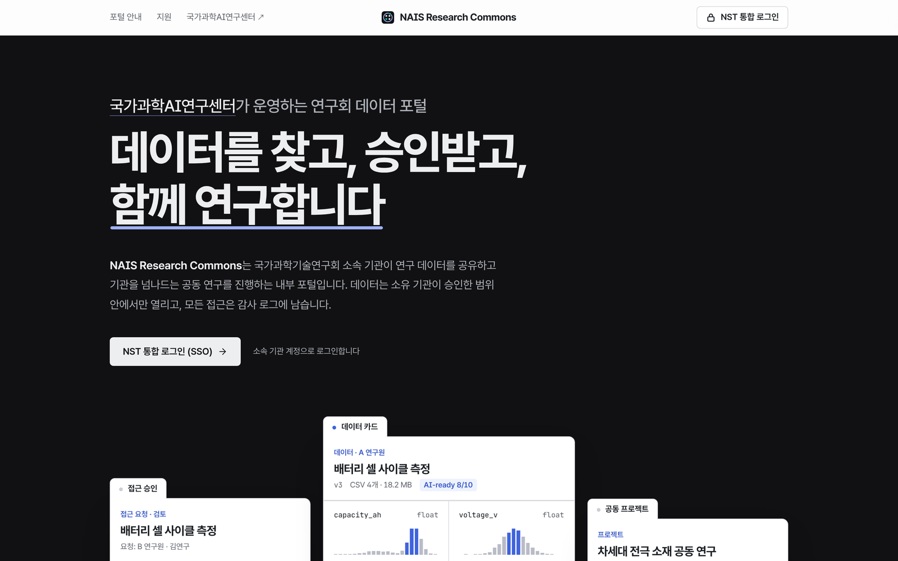 | 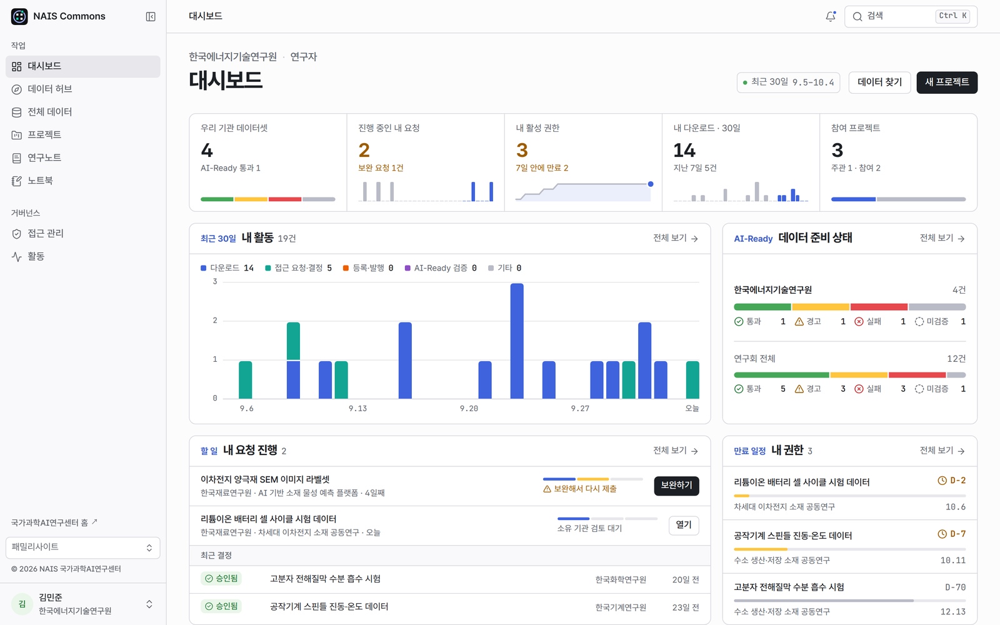 |
| **데이터 허브** | **전체 데이터 (검색)** |
| 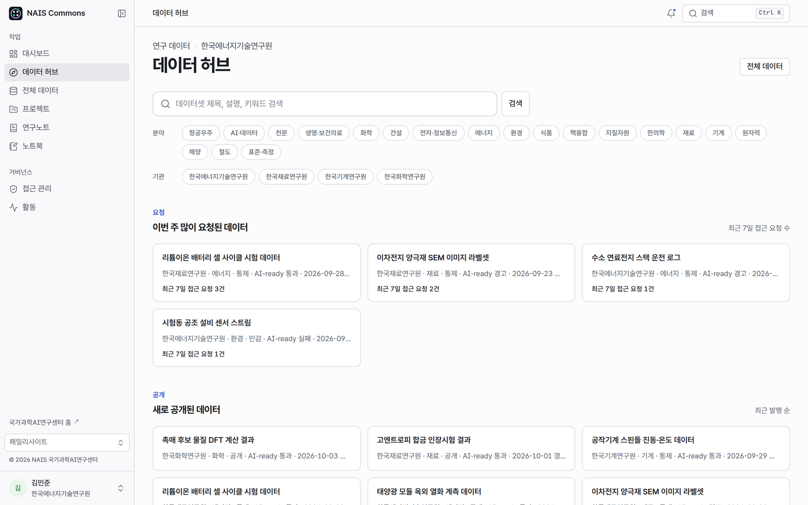 | 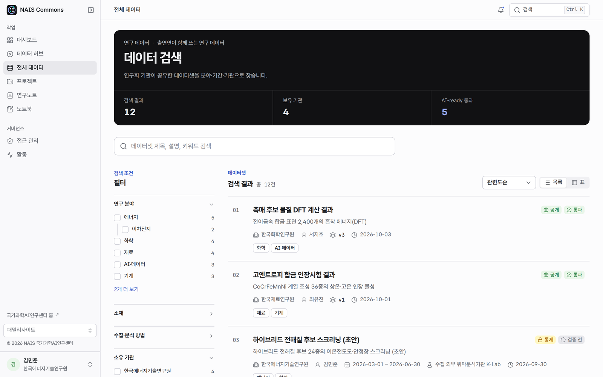 |
| **Data Card** | **버전 이력** |
| 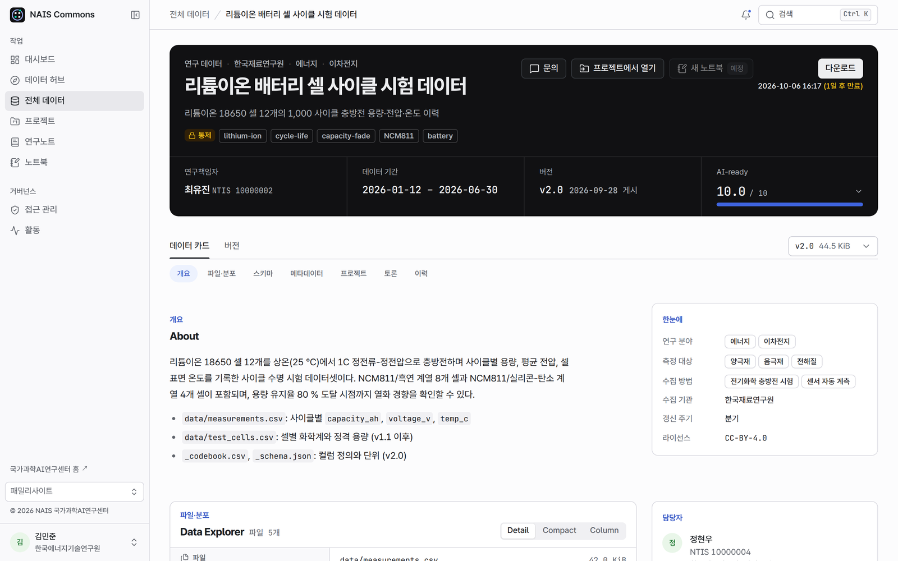 | 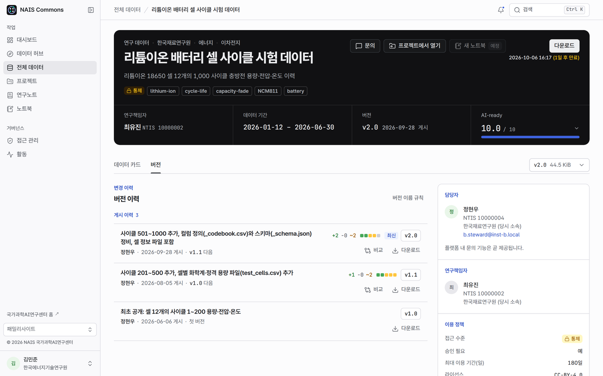 |
| **버전 비교** | |
| 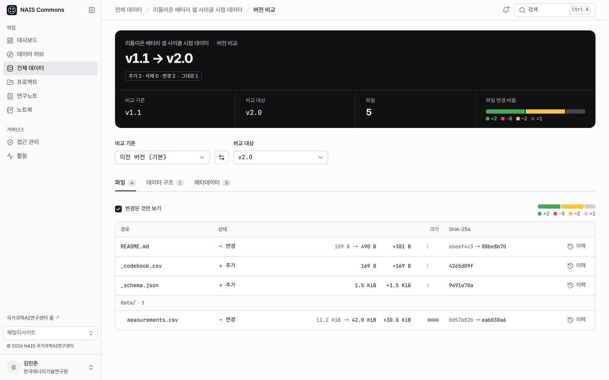 | |

### 프로젝트와 기록

| 프로젝트 작업 공간 | 노트북 탭 (JupyterLab) |
|---|---|
| 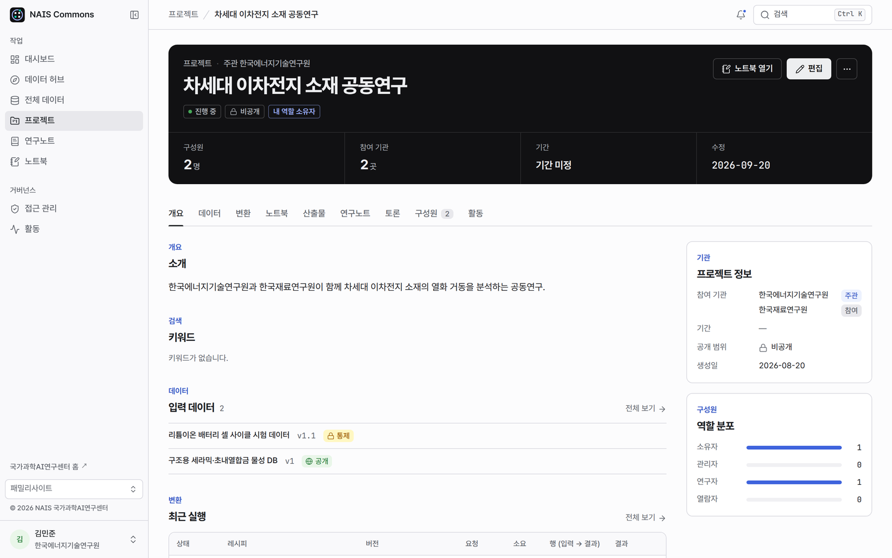 | 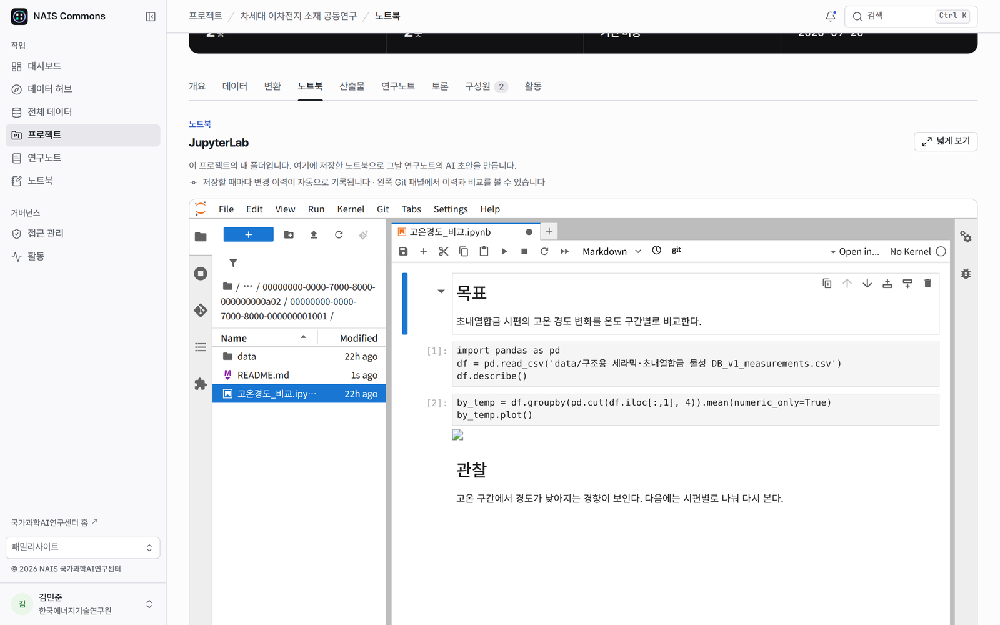 |
| **연구노트** | **접근 관리** |
| 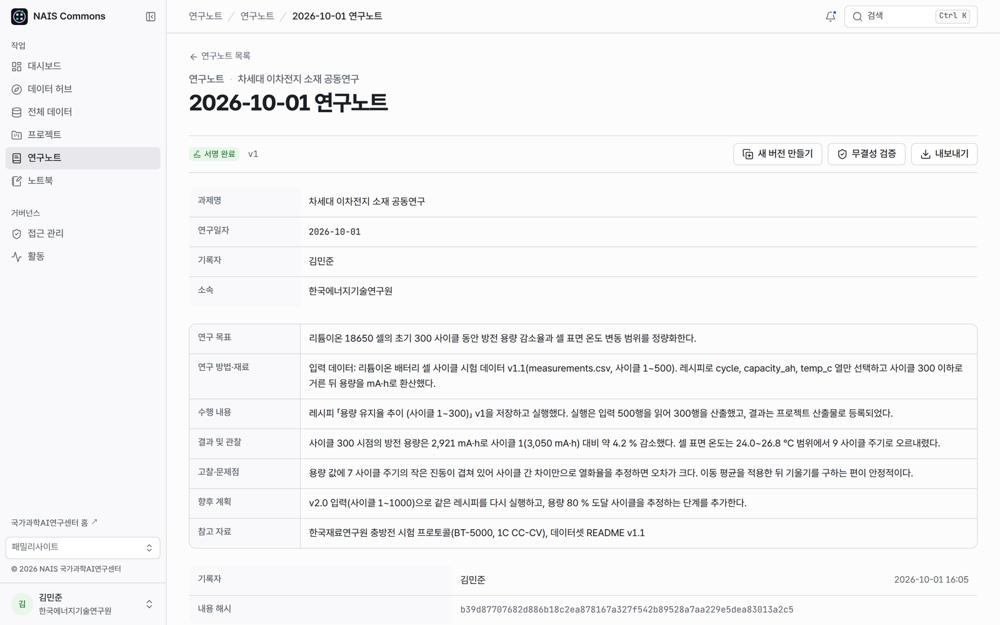 | 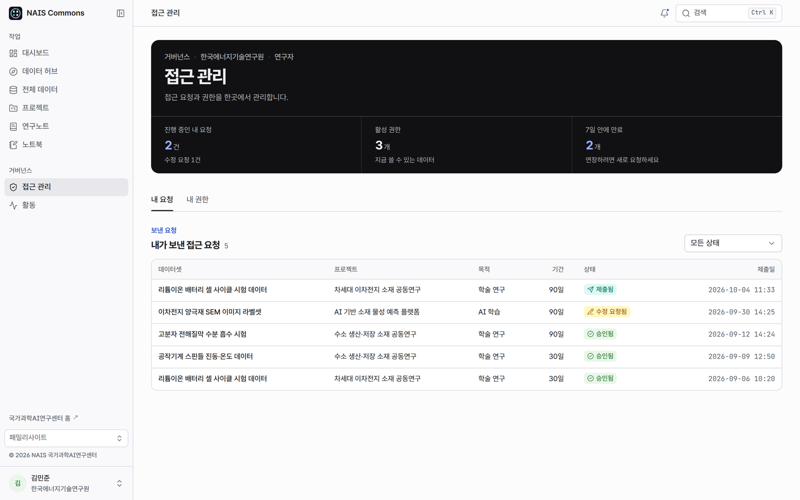 |

### 모바일

<p>
  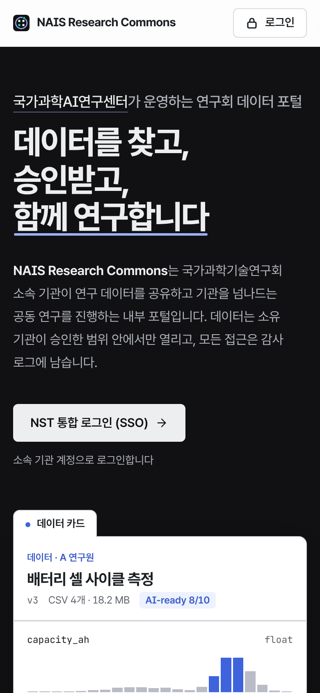
  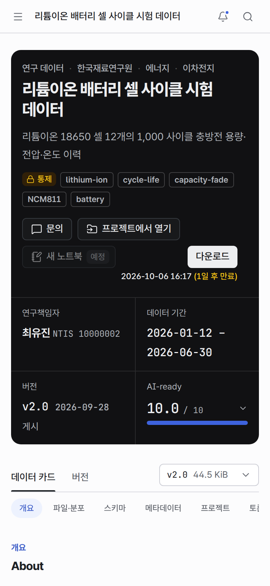
</p>

---

## 아키텍처

FastAPI modular monolith(api + Dramatiq worker)와 Next.js 웹을 nginx gateway 하나 뒤에 둡니다. 서비스 이름은 [`docker-compose.yml`](docker-compose.yml) 기준입니다.

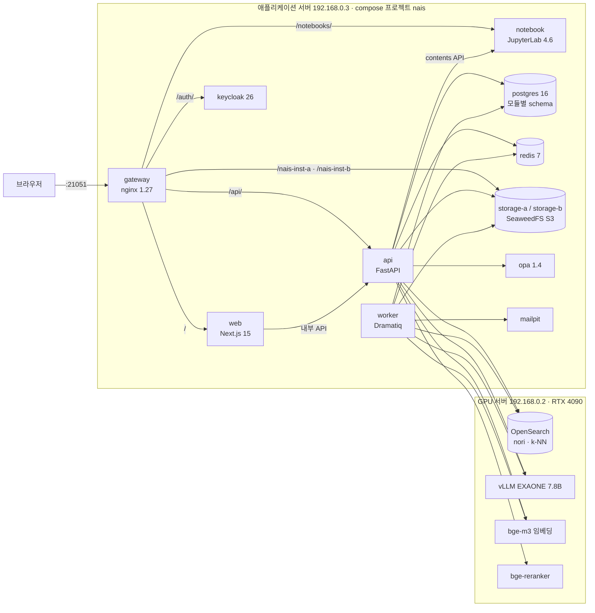

- **원천 데이터:** PostgreSQL이 기준입니다. OpenSearch 인덱스는 DB에서 다시 만들 수 있습니다(`reindex`).
- **OpenSearch:** 기본 compose에 없고 `OPENSEARCH_URL`로 외부 OpenSearch를 씁니다(2026-10-03부터). 로컬 컨테이너는 profile `legacy-opensearch`로만 뜹니다.
- **LLM·임베딩·리랭커:** `NAIS_LLM_ENABLED`로 켜고 끕니다(기본 꺼짐). 임베딩이 꺼져 있거나 제한 시간 안에 오지 않으면 데이터셋 검색은 낱말 검색만 씁니다. 연구노트 AI 초안은 LLM이 있어야 만들어집니다.
- **notebook 격리:** 내부 전용 네트워크 `notebooks`에만 붙어, 커널에서 postgres·redis·스토리지·keycloak·LAN·인터넷으로 나갈 수 없습니다(`pip install` 불가).
- **OPA:** 컨테이너는 떠 있고 `/health/ready`가 확인하지만 `infra/opa/policies`에 배포된 정책은 아직 없습니다(M04 미구현).

### API 모듈

각 모듈은 `apps/api/modules/<name>/__init__.py`의 `MODULE = ModuleSpec(...)`로 등록되고(D-036), 자기 PostgreSQL schema와 Alembic 마이그레이션만 소유합니다(D-021). 다른 모듈은 `public.py`의 Port로만 부릅니다(D-038).

| 모듈 | schema | 역할 |
|---|---|---|
| M00 Platform (`apps/api/platform`) | `platform` | 앱 구성, 인증(JWT/JWKS), outbox·relay·event bus, 스토리지, 검색 인덱스, LLM 클라이언트, CLI |
| M01 [Identity](apps/api/modules/identity/README.md) | `identity` | 사용자 JIT 생성, 기관·소속·역할, 기관 이동, NTIS 연구자번호 |
| M02 [Project](apps/api/modules/project/README.md) | `project` | 프로젝트·구성원(OWNER/ADMIN/RESEARCHER/VIEWER), 공개 프로젝트 검색 |
| M03 [Catalog](apps/api/modules/catalog/README.md) | `catalog` | 데이터셋·버전·파일·업로드(presigned PUT/멀티파트, sha256), 미리보기, 검색 인덱스, 버전 관리, JSON-LD |
| M05 [Readiness](apps/api/modules/readiness/README.md) | `readiness` | AI-ready 결정적 검증 |
| M09 [Audit](apps/api/modules/audit/README.md) | `audit` | append-only 감사 로그, 인앱·이메일 알림 |
| M13 [Workspace](apps/api/modules/workspace/README.md) | `workspace` | 입력·레시피·실행·산출물·계보·토론, 허브 공개 승인(D-043, D-047) |
| M14 Notes (`apps/api/modules/notes`) | `notes` | 연구노트, 서명·체인, 초안, 노트 검색 (모듈 README 없음, [`apps/api/README.md`](apps/api/README.md) 참고) |

M04 Governance는 계약과 소유 경로만 있고 코드는 없습니다([`module_ownership.json`](NAIS_PRD/contracts/module_ownership.json)).

### 계약과 이벤트

- **계약 우선:** 원본은 [`NAIS_PRD/contracts/`](NAIS_PRD/contracts)의 `openapi.yaml`(OpenAPI 3.1, 1.9.0, 114개 operation), `events/`(이벤트 42종), `error_codes.json`입니다. 생성물은 `packages/contracts`(pydantic·TS 타입)와 `apps/web/src/generated`이며, 변경은 [change request](docs/adr/CONTRACT_CHANGE_REQUEST.template.md)로 남깁니다.
- **이벤트:** transactional outbox로 발행합니다. 변경과 같은 세션에서 `outbox.write(...)`, worker의 relay가 전달하고, 소비자는 `claim_event(...)`로 at-least-once를 멱등 처리합니다(D-006).

---

## 기술 스택

| 영역 | 기술 |
|---|---|
| 백엔드 | Python 3.13, uv 0.11, FastAPI 0.142, SQLAlchemy 2.1, psycopg 3.3, Alembic 1.20(모듈별 이력), Pydantic 2.13, Dramatiq 2.2(Redis), boto3, pyarrow |
| 웹 | Next.js 15.5 (App Router), React 19.3, TypeScript 5.9, Tailwind CSS 4.3, TanStack Query 5, next-intl 4(기본 ko), Auth.js v5 beta, MSW 2(mock 모드), Base UI(`@nais/ui`), lucide, Pretendard |
| 게이트웨이·인증 | nginx 1.27, Keycloak 26.0(OIDC, PKCE), OPA 1.4.2 |
| 저장 | PostgreSQL 16 · Redis 7 · SeaweedFS 4.48(S3 호환, 기관별 버킷) · OpenSearch 2.x(nori, k-NN; 로컬 legacy 이미지는 2.19.1) |
| 노트북 | JupyterLab 4.6.4 (`quay.io/jupyter/scipy-notebook:lab-4.6.4`), Git 확장, nbdime diff, 저장 훅(`infra/notebook/nais_nb_hooks.py`) |
| 모델 (GPU 서버) | EXAONE 7.8B(vLLM, 모델 id `llm`) · bge-m3 · bge-reranker |
| 테스트 | pytest, testcontainers(PostgreSQL), ruff, mypy(strict), Vitest 3, Playwright 1.63, axe-core |

버전은 `uv.lock`, `pnpm-lock.yaml`, `docker-compose.yml` 이미지 태그 기준입니다.

---

## 저장소 구조

```
apps/
  api/          FastAPI 앱(main.py)과 Dramatiq 워커(worker.py)
    platform/   M00: 설정, DB, 인증, outbox·event bus, 스토리지, 검색 인덱스, LLM 클라이언트, CLI
    modules/    identity · project · catalog · readiness · audit · workspace · notes (모듈마다 schema·마이그레이션·Port)
  web/          Next.js 포털 (src/app 라우트, src/features 화면 기능, src/mocks mock API, e2e/ Playwright)
packages/
  contracts/    계약 생성물(python nais_contracts, ts openapi.d.ts)과 generate.py
  ui/           공용 UI 컴포넌트 @nais/ui
NAIS_PRD/       PRD, 모듈 명세, 결정 기록, 계약(openapi.yaml, 이벤트, 오류 코드)
infra/          nginx(gateway), keycloak(realm import), notebook(JupyterLab 설정·Git 훅), opa, opensearch, docker(postgres init·storage)
scripts/        nais(개발 명령 진입점), gate_a.sh, storage_smoke.py, check_no_public_ip.sh
tests/          contract(계약 파일 검사), infra(노트북 Git 훅), fixtures
docs/           adr(ADR·계약 변경 요청), superpowers/specs·plans(설계·계획), screenshots
docker-compose.yml        개발 스택 (prod 덮어쓰기: docker-compose.prod.yml)
```

---

## 시작하기

### 준비물

| 도구 | 버전 | 출처 |
|---|---|---|
| Docker + Compose v2 | `!override`/`!reset` 지원 버전 | `docker-compose.prod.yml` |
| Python · uv | 3.13 · 0.11 이상 (CI 0.11.19) | `.python-version`, `.github/workflows/ci.yml` |
| Node.js · pnpm | 22 · 9.15.0 (corepack) | `apps/web/Dockerfile`, `package.json` |

Node·pnpm은 웹을 컨테이너 밖에서 개발하거나 계약 생성물을 갱신할 때만 필요합니다.

### 처음 실행

```bash
git clone https://github.com/nigel1513/nais-nexus.git && cd nais-nexus
cp .env.example .env        # scripts/nais up 이 없으면 만들어 줍니다
```

`.env`에서 최소한 다음을 정합니다(값은 커밋하지 않습니다).

- `NAIS_JUPYTER_TOKEN`, `NAIS_INTERNAL_TOKEN`: 예) `openssl rand -hex 32`. `NAIS_JUPYTER_TOKEN`이 비어 있으면 `notebook`은 시작을 거부합니다.
- `AUTH_SECRET`: 32바이트 이상 임의 값.
- `OPENSEARCH_URL`: 이미 있는 OpenSearch 2.x(k-NN, `analysis-nori` 권장)를 지정하거나, 로컬 컨테이너를 쓰려면 `COMPOSE_PROFILES=legacy-opensearch`와 `OPENSEARCH_ADMIN_PASSWORD`를 넣고 URL에 admin 계정을 포함합니다. 닿지 않으면 `/api/v1/health/ready`가 503(`degraded`)입니다. nori가 없으면 `standard` + `cjk_bigram` 분석기를 씁니다.

```bash
scripts/nais up             # docker compose up -d --build
scripts/nais migrate        # platform + 모든 모듈 마이그레이션
scripts/nais storage-init   # 기관별 버킷 생성
scripts/nais seed           # 개발 seed (NAIS_PRD/10_SEED_DATA.md)
scripts/nais credentials    # 포트·계정 표
scripts/nais gate-a         # 부팅 + health + 스토리지 smoke
```

`Makefile`은 `scripts/nais`에 위임만 합니다(D-033).

### 포트

| 포트 | 서비스 | 비고 |
|---:|---|---|
| 21051 | gateway | 포털 `/`, API `/api/v1`(문서 `/api/v1/docs`), Keycloak `/auth/`, JupyterLab `/notebooks/` |
| 21052 | mailpit UI | 개발용 메일함 |
| 21053 · 21054 | storage-a · storage-b S3 | 디버깅용 |
| 21055 | postgres | DB `nais` |
| 21056 · 21057 | gateway → OpenSearch · OPA | Basic 인증 |
| 21058 | redis | |

개발 서버에서는 21051~21058이 외부에 열려 있습니다(D-037). 외부 주소는 로컬 `.env`의 `NAIS_EXTERNAL_HOST`에만 둡니다. `docker-compose.prod.yml`은 21051만 남깁니다.

개발 스택의 모든 계정은 `nais` / `nais`입니다(Postgres, Keycloak 관리자, S3 키, Mailpit, Redis, gateway Basic 인증, seed 사용자 `admin@nais.local`·`a.researcher@inst-a.local` 등). **개발 전용이며 외부 공개 운영 환경에서 그대로 쓰면 안 됩니다.**

### mock 모드와 real 모드

웹 모드는 빌드 시점에 정해집니다. compose가 `.env`의 `WEB_API_MOCKING`을 빌드 인자 `NEXT_PUBLIC_API_MOCKING`과 런타임 값으로 함께 넘깁니다.

| 모드 | `WEB_API_MOCKING` | 동작 |
|---|---|---|
| mock (기본, 현재 21051) | `enabled` | 웹 서버 안의 MSW mock API(seed 기반 메모리 상태, 재시작 시 초기화), `/mock-login`. `NAIS_INTERNAL_TOKEN`이 있으면 연구노트 초안, 노트북, 데이터셋·공개 프로젝트 검색은 내부 API로 실제 Jupyter·LLM·OpenSearch를 씀 |
| real | `disabled` | Keycloak 로그인(Authorization Code + PKCE, 클라이언트 `nais-web`)과 실제 API, 단일 origin(`NAIS_PUBLIC_BASE_URL`). M04 기능은 백엔드가 없어 동작하지 않음 |

모드를 바꾸면 `docker compose build web && docker compose up -d --no-build web`으로 웹을 다시 빌드합니다. real 모드 규칙은 [`apps/web/README.md`](apps/web/README.md)의 "Real mode"에 있습니다.

---

## 설정

모든 값은 `.env`(`.env.example`에서 복사)로 넣고 api·worker·web이 같은 파일을 읽습니다. **`.env`는 커밋하지 않습니다.** 기본값은 `.env.example` 기준입니다.

| 영역 | 변수 | 설명 |
|---|---|---|
| 기본 | `NAIS_PUBLIC_BASE_URL` · `NAIS_GATEWAY_PORT` · `NAIS_EXTERNAL_HOST` | 브라우저 기준 URL(presigned URL 서명, Keycloak hostname) · 공개 포트 `21051` · 외부 주소(로컬 `.env`에만) |
| DB·큐 | `DATABASE_URL` · `MIGRATION_DATABASE_URL` · `REDIS_URL` | 런타임 `nais_app` · 마이그레이션 `nais_migrator`(schema owner, D-027) · Dramatiq broker |
| 인증 (API) | `OIDC_ISSUER` · `OIDC_INTERNAL_JWKS_URL` · `OIDC_AUDIENCE` · `KEYCLOAK_ADMIN_*` | JWT 검증, 기관 이동 시 Keycloak `org_code` 갱신 |
| 인증 (웹) | `AUTH_URL` · `AUTH_SECRET` · `AUTH_KEYCLOAK_*` · `AUTH_ALLOWED_HOSTS` | Auth.js(`AUTH_URL`은 `/web-auth`로 끝남, D-026) |
| 내부 API | `NAIS_INTERNAL_TOKEN` | 웹 서버 → `/api/v1/internal/*` 헤더. 비어 있으면 내부 API는 404 |
| 스토리지 | `STORAGE_ORG_CODES` · `STORAGE_<CODE>_ENDPOINT`·`_BUCKET`·`_ACCESS_KEY`·`_SECRET_KEY` | 기관별 S3(D-024), 기본 `nais,inst-a,inst-b` |
| 업로드 | `STORAGE_PRESIGN_TTL_SECONDS` · `STORAGE_MULTIPART_THRESHOLD_BYTES` · `UPLOAD_*_TTL_SECONDS` | `300`초 · 64 MiB · `3600`초 |
| 검색·정책 | `OPENSEARCH_URL` · `CATALOG_INDEX_ALIAS` · `OPA_URL` · `OPA_TIMEOUT_MS` | alias `nais-datasets`, OPA 실패 시 거부(D-022), `500`ms |
| LLM | `NAIS_LLM_ENABLED` · `NAIS_LLM_*` · `NAIS_EMBED_*` · `NAIS_RERANK_*` · `NAIS_SEARCH_TIMEOUT_S` | 기본 꺼짐(`false`). OpenAI 호환 vLLM, 모델 `llm`·`bge-m3`·`bge-reranker` |
| 노트북 | `NAIS_JUPYTER_URL` · `NAIS_JUPYTER_TOKEN` | 공유 JupyterLab contents API와 "노트북 열기" |
| 작업 한도 | `WORKSPACE_*` · `READINESS_*` | 레시피 실행(500만 행, 1 GiB, 1800초) · AI-ready 검증 한도 |
| 알림 | `SMTP_*` · `NOTIFICATION_EMAIL_ENABLED` · `NOTIFICATION_RETENTION_DAYS` | `mailpit:1025`, 보관 180일 |
| 웹 공개 | `WEB_API_MOCKING` · `NEXT_PUBLIC_API_BASE` · `NEXT_PUBLIC_PARENT_SITE_URL` | 빌드 시 인라인되므로 바꾸면 다시 빌드. 상위 사이트 URL은 Dockerfile 빌드 인자이며 compose는 아직 넘기지 않음 |

---

## 운영

운영 반영 절차의 정본은 [`apps/api/README.md`](apps/api/README.md)("운영 반영 순서")입니다.

1. **백업:** `docker compose exec -T postgres pg_dump -U nais -Fc nais > nais-$(date +%Y%m%d-%H%M).dump`
2. **되돌리기용 태그:** `docker tag nais/api:dev nais/api:pre-<변경명>` (web도 같게)
3. **빌드:** `docker compose build api worker web`
4. **마이그레이션 (재시작 전):** `scripts/nais migrate`. 마이그레이션은 추가만 하며 downgrade는 쓰지 않습니다.
5. **재시작 (`down` 없이):** `docker compose up -d --no-build api worker web`
6. **되돌리기:** 태그를 `:dev`로 되돌린 뒤 5번을 다시 실행

마이그레이션은 `docker compose run --rm --no-deps api python -m api.platform.cli migrate --sql > /dev/null`로 SQL만 먼저 확인하고(CI와 같음), 실제 데이터로 확인하려면 백업을 `nais_dryrun` DB에 복원해 먼저 적용합니다(절차는 `apps/api/README.md`).

| 할 일 | 명령·위치 |
|---|---|
| 상태 확인 | gateway `GET /healthz`, api `GET /api/v1/health/live` · `/health/ready`(postgres·redis·opensearch·opa) |
| 로그 | `scripts/nais logs api worker`. JupyterLab 경로와 `/notebooks-open`은 토큰 때문에 access log를 남기지 않음 |
| 데이터셋 인덱스 재구축 | `docker compose run --rm --no-deps api python -m api.modules.catalog.reindex` (새 `nais-datasets-vN` + alias 교체) |
| 공개 프로젝트 인덱스 | worker가 5초마다 DB와 맞춤, 별도 명령 없음 |
| 워커 | 레플리카 1개만(`--scale worker=N` 금지). 전용 큐 `catalog_previews`, `readiness`, `workspace`, `notes`(GPU 공유) |
| gateway 설정 | `infra/nginx/nais.conf` 수정 후 `docker compose exec gateway nginx -s reload` |

| 백업 대상 | 위치 | 비고 |
|---|---|---|
| PostgreSQL | volume `pgdata` | 모든 모듈 schema, 감사 로그, 연구노트 |
| 객체 스토리지 | volumes `storage-a`, `storage-b` | 데이터셋 파일, 산출물 |
| 노트북 작업 폴더 | volume `notebookwork` | `.ipynb`와 폴더별 Git 이력 |
| 설정 | `.env`, `infra/nginx/htpasswd`, `infra/nginx/opensearch-auth.conf` | 비밀 값 포함, 저장소 밖에 보관 |

- **Keycloak:** `start-dev` 내장 DB를 쓰고 volume이 없어, 컨테이너를 다시 만들면 `infra/keycloak/import/realm-nais.json` 상태로 돌아갑니다.
- **운영 compose:** `docker compose -f docker-compose.yml -f docker-compose.prod.yml up -d`는 개발 도구 포트를 닫고 웹을 real 모드로 빌드하며 Keycloak을 `start`로 실행합니다. 다만 realm import가 아직 개발 realm(seed 사용자, password grant 클라이언트 `nais-e2e`)이라, 운영 전에 realm과 모든 기본 계정을 바꿔야 합니다.

---

## 테스트와 품질

```bash
uv sync
scripts/nais test              # pytest: apps/api, tests/contract, tests/infra (testcontainers, Docker 필요)
scripts/nais lint              # ruff check + ruff format --check
scripts/nais typecheck         # mypy (strict)
scripts/nais contracts-check   # 계약 생성물이 최신인지 (갱신은 scripts/nais contracts)

corepack pnpm install
corepack pnpm --filter @nais/web test             # Vitest (mock API가 openapi.yaml과 맞는지도 검사)
corepack pnpm --filter @nais/web lint
corepack pnpm --filter @nais/web typecheck
corepack pnpm --filter @nais/web contracts:check  # src/generated 와 계약 비교
corepack pnpm --filter @nais/web e2e              # Playwright
```

- **Playwright:** `chromium`(localhost)과 `chromium-insecure-origin`(`http://nais.test:<port>`, secure context가 아닌 HTTP origin) 두 프로젝트로 돕니다. 실행 중인 포털을 대상으로 하려면 `PLAYWRIGHT_BASE_URL`을 씁니다.
- **선택 테스트:** 실제 GPU LLM 스모크 `NAIS_LIVE_LLM=1 … -m live_llm`([`apps/api/README.md`](apps/api/README.md)), 실행 중인 스택 대상 `NAIS_LIVE=1 uv run pytest apps/api/modules/identity/tests/test_live_stack.py`.
- **CI**([`.github/workflows/ci.yml`](.github/workflows/ci.yml)): python(lint, mypy, pytest, `migrate --sql`), contracts, web(contracts·lint·typecheck·Vitest, `packages/ui`, real 모드 빌드), gate-a.

---

## 보안

- **인증과 역할:** Keycloak은 인증만 맡고, 사용자·기관·역할의 원본은 NAIS identity DB입니다(D-019). 요청마다 상태와 역할을 다시 읽어 비활성 사용자·소속을 막습니다.
- **데이터 접근:** deny-by-default. 접근 등급은 `PUBLIC`, `INTERNAL`, `CONTROLLED`, `SENSITIVE`입니다. 볼 수 없는 데이터셋은 404로 답해 존재를 드러내지 않습니다. 미리보기는 PLATFORM_ADMIN, 소유 기관 구성원, PUBLIC 데이터셋에만 허용되며, 기한부 권한(grant) 경로는 M04 전까지 항상 거부입니다(fail-closed).
- **원본 값 보호:** AI-ready 결과와 버전 비교는 통계·위치·열 프로파일만 담습니다(D-018). 연구노트 AI 초안의 입력 제한은 [주요 기능](#주요-기능) 참고.
- **개인정보:** 모듈 간 Port로 사용자 이메일을 읽는 것은 메일 발송(M09)과 공개 연락처(M03)에만 허용됩니다(`IdentityQueryPort.get_email`).
- **감사:** 감사 테이블은 `nais_app`에 INSERT·SELECT만 허용하고 트리거로 수정·삭제를 막습니다(D-027).
- **내부 API:** `/api/v1/internal/*`은 gateway에서 항상 404이며, docker 네트워크 안의 웹 서버만 `X-NAIS-Internal-Token`으로 부릅니다.
- **노트북:** 공유 토큰 하나로 운영하는 시연 수준 보안입니다(D-049). 토큰은 `/notebooks-open`이 세션과 프로젝트 구성원을 확인한 뒤에만 넘깁니다.
- **알려진 위험:** 개발 스택은 모든 포트와 단일 계정 `nais`/`nais`를 외부에 노출합니다(D-037, 소유자 수용). api·worker 컨테이너는 root로 실행되며, 미리보기 하위 프로세스의 잔여 위험은 [catalog README](apps/api/modules/catalog/README.md)에 있습니다.

보안 문제는 공개 이슈로 올리지 말고 저장소 소유자에게 비공개로 알려 주세요(GitHub 프로필의 연락처 또는 GitHub Security Advisory).

---

## 문서

| 문서 | 내용 |
|---|---|
| [`NAIS_PRD/README.md`](NAIS_PRD/README.md) | PRD 색인과 읽는 순서 |
| [`NAIS_PRD/11_DECISION_LOG.md`](NAIS_PRD/11_DECISION_LOG.md) | 결정 기록 D-001~D-049 |
| [`NAIS_PRD/07_RUNTIME_ENVIRONMENT.md`](NAIS_PRD/07_RUNTIME_ENVIRONMENT.md) | 포트, gateway 라우팅, compose |
| [`NAIS_PRD/modules/`](NAIS_PRD/modules) · [`NAIS_PRD/contracts/`](NAIS_PRD/contracts) | 모듈별 명세 · API·이벤트·오류 코드 계약 |
| [`docs/adr/`](docs/adr) | ADR과 계약 변경 요청 |
| [`docs/superpowers/specs/`](docs/superpowers/specs) · [`plans/`](docs/superpowers/plans) | 기능 설계(데이터 포털, 허브·작업 공간·노트, 노트북, 연구 동향, UI) · 구현 계획 |
| [`apps/api/README.md`](apps/api/README.md) · [`apps/web/README.md`](apps/web/README.md) | api·worker 운영 메모 · 웹 실행, mock/real 모드, e2e |
| `apps/api/modules/*/README.md` | [identity](apps/api/modules/identity/README.md), [project](apps/api/modules/project/README.md), [catalog](apps/api/modules/catalog/README.md), [readiness](apps/api/modules/readiness/README.md), [audit](apps/api/modules/audit/README.md), [workspace](apps/api/modules/workspace/README.md) |

`NAIS_PRD_COMBINED.md`는 `NAIS_PRD/`를 합친 생성물이므로 직접 고치지 않습니다.

---

## 개발 규칙

- **브랜치:** 통합 브랜치는 `feat/wave15`입니다. 여기서 갈라진 브랜치에서 작업하고, 리뷰를 통과하면 병합한 뒤 브랜치를 지웁니다. `main`에는 저장소 소유자가 요청할 때만 병합합니다.
- **커밋 메시지:** `feat(<영역>): ...`, `fix(...)`, `docs(...)`, `test(...)`, `chore(...)`.
- **공인 IP 금지:** 서버 공인 IP는 어떤 파일에도 쓰지 않고 `.env`의 `NAIS_EXTERNAL_HOST`나 `<NAIS_EXTERNAL_HOST>` 자리표시자를 씁니다. 커밋 전에 `scripts/check_no_public_ip.sh`를 실행합니다.
- **비밀값:** `.env`, `infra/nginx/opensearch-auth.conf`는 커밋하지 않습니다.
- **계약 먼저:** `openapi.yaml`·이벤트를 먼저 바꾸고 change request를 남긴 뒤 `scripts/nais contracts`와 `corepack pnpm --filter @nais/web contracts:sync`로 생성물을 갱신합니다.

### 모듈 추가

1. `apps/api/modules/<name>/__init__.py`에 `MODULE = ModuleSpec(...)`을 정의합니다: `router`(`/api/v1` 아래), `migrations_dir` + `db_schema`(새 revision은 `scripts/nais new-migration <name> -m "..."`), `wire()`(Port 제공), `register_worker(broker, scheduler)`·`dedicated_queues`, `seed(session)`(`10_SEED_DATA.md`의 행을 코드 안 데이터로).
2. 다른 모듈이 쓸 Port Protocol과 DTO는 `public.py`에 둡니다(D-038). 소비자는 `ports.get(XPort)`를 쓰고 Protocol을 복사하지 않습니다.
3. 새 schema는 `infra/docker/postgres/init.sql`에 추가하고, 기존 DB에는 배포 때 한 번 만듭니다.
4. 소유 경로를 `module_ownership.json`에 추가합니다.

점검표:

- **세션:** 엔드포인트는 `session: SessionDep`를 받습니다. 응답 전에 커밋하므로 커밋 실패는 500 envelope입니다. 직접 `session.commit()`을 쓰지 않습니다.
- **멱등성**(D-006): 모든 핸들러는 `if not claim_event(session, "<schema>", event): return`으로 시작합니다. 같은 이벤트를 여러 핸들러가 받으면 `per_handler=True`와 `handler="<name>"`을 씁니다.
- **핸들러 등록:** 패키지 `__init__.py`에서 import합니다. worker 시작 로그의 `event subscriptions` 표로 확인합니다.
- **마이그레이션:** 모든 `op.*`에 `schema="<db_schema>"`를 주고 다른 모듈 schema는 건드리지 않습니다. `pg_trgm`은 platform이 `public`에 한 번 설치합니다.
- **outbox:** 핸들러 안에서 `platform.outbox_events`를 수정하지 않습니다(relay 행 잠금과 교착). 후속 이벤트는 `outbox.write(session, ...)`로만 발행합니다.
- **테스트 도구:** `create_test_app`, fixture `migrated_db`, `FakeIssuer`, `assert_matches_response` / `assert_valid_event` (`api.platform.testing`).

---

## 로드맵

| 단계 | 내용 | 계약 |
|---|---|---|
| Wave 0 | 플랫폼 기반: compose, gateway, 모듈 플러그인, outbox, 마이그레이션, CI | |
| Wave 1 | M01 identity, M02 project, M03 catalog, M05 readiness, M09 audit, M10 web(mock 모드) | 1.2 |
| Wave 1.5 Stage 1 | Data Card, Data Explorer, 연구 메타데이터·어휘, JSON-LD, 기관 이동, NTIS 번호 | 1.3 |
| Wave 1.5 Stage 2 | lakeFS식 버전 관리: rebase, 비교, 파일 이력, 인용 (D-041) | 1.4 |
| 허브·작업 공간·연구노트 | M13 workspace, M14 notes, 로컬 LLM 초안 (D-043~D-047) | 1.6, 1.7 |
| M07-lite | 공유 JupyterLab, 프로젝트별 작업 공간, 저장 시 Git 이력 (D-049) | 1.8 |
| 하이브리드 검색 | 데이터셋 인덱스 v3(bge-m3), 공개 프로젝트 인덱스, mock 모드 검색 브리지 | 1.9 |

남은 일:

- **M04 접근 거버넌스:** 접근 요청·승인·grant·OPA 정책 백엔드. 이것이 있어야 real 모드 웹을 기본으로 전환할 수 있습니다(Wave 2).
- **Stage 3·4:** 파일 역할(raw/processed)과 계보 탭, 데이터셋 1:1 문의와 담당자 부재 알림.
- **연구 동향**(논문·학회): 설계만 있습니다([설계](docs/superpowers/specs/2026-10-01-research-trends-design.md)). 설계의 모듈 번호 M13은 workspace가 쓰고 있어 구현 시 다시 정해야 합니다.
- **discovery 인덱스:** 업로드마다 자동 적재되는 검색·연결 지도(OpenSearch + 그래프 DB), 설계 중.
- **전체 M07:** 사용자별 노트북 서버(계약 1.5.0 예약, [계획](docs/superpowers/plans/2026-10-01-m07-notebooks.md)).
- **운영 준비:** 운영 Keycloak realm, 기본 계정 교체, 스크립트 nonce 기반 CSP.

---

## 라이선스

라이선스 미정입니다. 저장소에 `LICENSE` 파일이 없으며, 사용·재배포 조건은 저장소 소유자에게 문의하세요.
